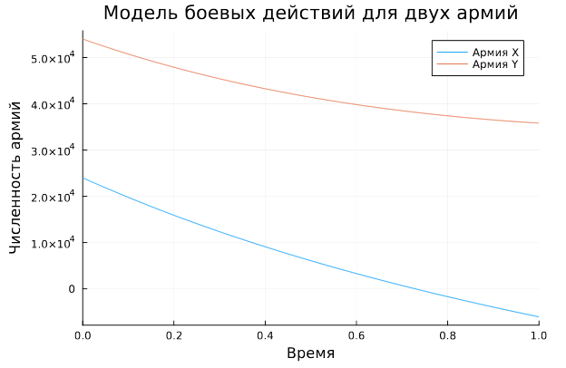
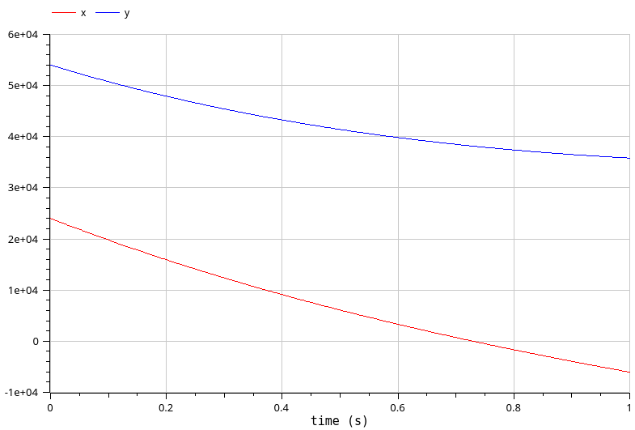
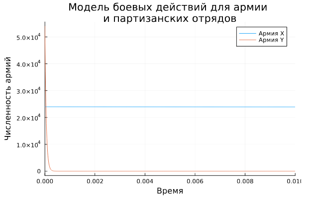
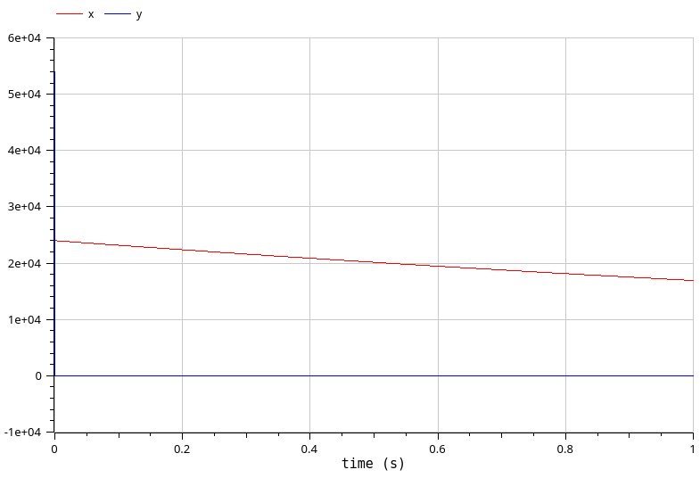

---
## Front matter
lang: ru-RU
title: Лабораторная работа №3
subtitle: Модель боевых действий
author:
  - Клюкин М. А.
institute:
  - Российский университет дружбы народов, Москва, Россия
  

## i18n babel
babel-lang: russian
babel-otherlangs: english

## Formatting pdf
toc: false
toc-title: Содержание
slide_level: 2
aspectratio: 169
section-titles: true
theme: metropolis
header-includes:
 - \metroset{progressbar=frametitle,sectionpage=progressbar,numbering=fraction}
 - \usepackage{fontspec}
 - \usepackage{polyglossia}
 - \setmainlanguage{russian}
 - \setotherlanguage{english}
 - \newfontfamily\cyrillicfont{Arial}
 - \newfontfamily\cyrillicfontsf{Arial}
 - \newfontfamily\cyrillicfonttt{Arial}
 - \setmainfont{Arial}
 - \setsansfont{Arial}
 
---


## Докладчик

:::::::::::::: {.columns align=center}
::: {.column width="70%"}

  * Клюкин Михаил Александрович
  * студент
  * Российский университет дружбы народов
  * [1132226431@pruf.ru](mailto:1132226431@pfur.ru)
  * <https://MaKYaro.github.io/ru/>

:::
::: {.column width="30%"}


:::
::::::::::::::

## Цели работы

Построить модель боевых действий, используя язык программирования Julia и систему OpenModelica.

## Задание

Постройте графики изменения численности войск армии $Х$ и армии $У$ для
следующих случаев:

1. Модель боевых действий между регулярными войсками

2. Модель ведение боевых действий с участием регулярных войск и партизанских отрядов

# Выполнение лабораторной работы

## Модель боевых действий между регулярными войсками

$$
\begin{cases}
  \dfrac{dx}{dt} = -0.4x(t) - 0.64y(t) + sin(t+5) + 1\\
  \dfrac{dy}{dt} = -0.77x(t) - 0.3y(t) + cos(t+5) + 1
\end{cases}
$$

## Модель боевых действий между регулярными войсками

```Julia
using DifferentialEquations, Plots;

function two_armies(u, p, t)
    x, y = u
    a, b, c, h = p
    dx = -a*x - b*y + sin(t + 5) + 1
    dy = -c*x - h*y + cos(t + 5) + 1
    return [dx, dy]
end
```

## Модель боевых действий между регулярными войсками

```Julia
u0 = [24000, 54000]
p = [0.4, 0.64, 0.77, 0.3]
tspan = (0,1)
```

## Модель боевых действий между регулярными войсками

```Julia
problem = ODEProblem(two_armies, u0, tspan, p)
solution = solve(problem, Tsit5())
plot(solution, title = "Модель боевых действий для двух армий",   
label = ["Армия X" "Армия Y"], xaxis = "Время", yaxis = "Численность армий")

```

## Модель боевых действий между регулярными войсками

{#fig:001 width=70%}

## Модель боевых действий между регулярными войсками

```OpenModelica
 parameter Real a = 0.4; 
 parameter Real b = 0.64;
 parameter Real c = 0.77;
 parameter Real h = 0.3;
```

## Модель боевых действий между регулярными войсками

```OpenModelica
 parameter Real x0 = 24000;
 parameter Real y0 = 54000;
 Real x(start=x0);
 Real y(start=y0);
```

## Модель боевых действий между регулярными войсками

```OpenModelica
equation
 der(x) = -a*x - b*y + sin(time + 5) + 1;
 der(y) = -c*x - h*y + cos(time + 5) + 1;
```

## Модель боевых действий между регулярными войсками

{#fig:002 width=70%}

## Модель боевых действий с участием регулярных войск и партизанских отрядов

$$
\begin{cases}
  \dfrac{dx}{dt} = -0.35x(t) - 0.67y(t) + sin(2t) + 2\\
  \dfrac{dy}{dt} = -0.77x(t)y(t) - 0.45y(t) + cos(t) + 1
\end{cases}
$$

## Модель боевых действий с участием регулярных войск и партизанских отрядов

```Julia
function one_army(u, p, t)
    x, y = u
    a, b, c, h = p
    dx = -a*x - b*y + sin(2*t) + 2
    dy = -c*x*y - h*y + cos(t) + 1
    return [dx, dy]
end
```

## Модель боевых действий с участием регулярных войск и партизанских отрядов

```Julia
u0 = [24000, 54000]
p = [0.35, 0.67, 0.77, 0.45]
tspan = (0, 0.01)
```

## Модель боевых действий с участием регулярных войск и партизанских отрядов

```Julia
problem = ODEProblem(one_army, u0, tspan, p)
solution = solve(problem, Tsit5())

plot(solution,   
title = "Модель боевых действий для армии \nи партизанских отрядов",    
label = ["Армия X" "Армия Y"], xaxis = "Время", yaxis = "Численность армий")
```

## Модель боевых действий с участием регулярных войск и партизанских отрядов

{#fig:003 width=60%}

## Модель боевых действий с участием регулярных войск и партизанских отрядов

```OpenModelica
 parameter Real a = 0.35; 
 parameter Real b = 0.67;
 parameter Real c = 0.77;
 parameter Real h = 0.45;
```

## Модель боевых действий с участием регулярных войск и партизанских отрядов

```OpenModelica
 parameter Real x0 = 24000;
 parameter Real y0 = 54000;
 Real x(start=x0);
 Real y(start=y0);
```

## Модель боевых действий с участием регулярных войск и партизанских отрядов

```OpenModelica
equation
 der(x) = -a*x - b*y + sin(2*time) + 2;
 der(y) = -c*x*y - h*y + cos(time) + 1;
```

## Модель боевых действий с участием регулярных войск и партизанских отрядов

{#fig:004 width=60%}

## Выводы

В результате выполнения лабораторной работы построили модель боевых действий с помощью языка программирования Julia и с помощью системы OpenModelica.

