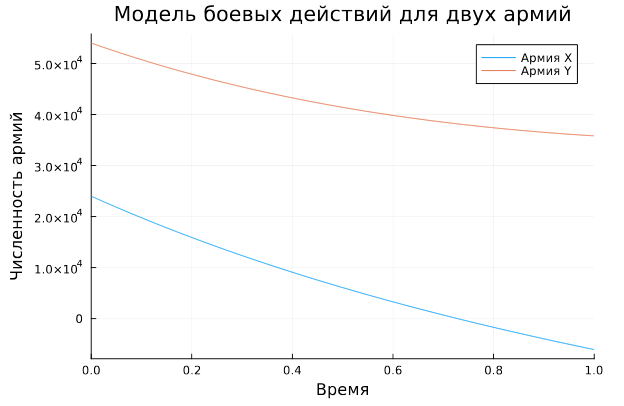
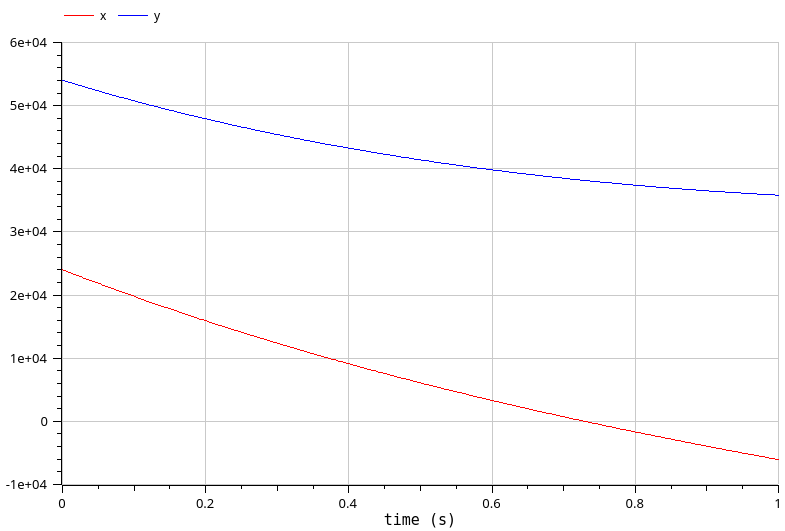
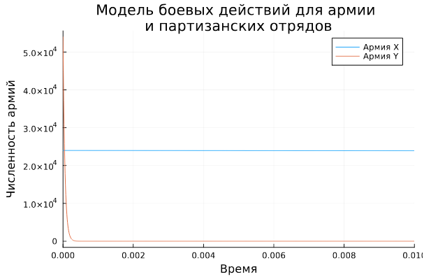
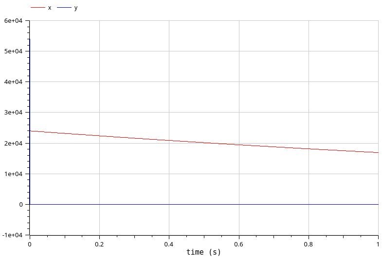

---
## Front matter
title: "Лабораторная работа №3"
subtitle: "Модель боевых действий"
author: "Клюкин Михаил Александрович"

## Generic otions
lang: ru-RU
toc-title: "Содержание"

## Bibliography
bibliography: bib/cite.bib
csl: pandoc/csl/gost-r-7-0-5-2008-numeric.csl

## Pdf output format
toc: true # Table of contents
toc-depth: 2
lof: true # List of figures
lot: true # List of tables
fontsize: 12pt
linestretch: 1.5
papersize: a4
documentclass: scrreprt
## I18n polyglossia
polyglossia-lang:
  name: russian
  options:
	- spelling=modern
	- babelshorthands=true
polyglossia-otherlangs:
  name: english
## I18n babel
babel-lang: russian
babel-otherlangs: english
## Fonts
mainfont: IBM Plex Serif
romanfont: IBM Plex Serif
sansfont: IBM Plex Sans
monofont: IBM Plex Mono
mathfont: STIX Two Math
mainfontoptions: Ligatures=Common,Ligatures=TeX,Scale=0.94
romanfontoptions: Ligatures=Common,Ligatures=TeX,Scale=0.94
sansfontoptions: Ligatures=Common,Ligatures=TeX,Scale=MatchLowercase,Scale=0.94
monofontoptions: Scale=MatchLowercase,Scale=0.94,FakeStretch=0.9
mathfontoptions:
## Biblatex
biblatex: true
biblio-style: "gost-numeric"
biblatexoptions:
  - parentracker=true
  - backend=biber
  - hyperref=auto
  - language=auto
  - autolang=other*
  - citestyle=gost-numeric
## Pandoc-crossref LaTeX customization
figureTitle: "Рис."
tableTitle: "Таблица"
listingTitle: "Листинг"
lofTitle: "Список иллюстраций"
lotTitle: "Список таблиц"
lolTitle: "Листинги"
## Misc options
indent: true
header-includes:
  - \usepackage{indentfirst}
  - \usepackage{float} # keep figures where there are in the text
  - \floatplacement{figure}{H} # keep figures where there are in the text
---

# Цель работы

Построить модель боевых действий с помощью языка Julia и с помощью OpenModelica.

# Задание

Между страной Х и страной У идет война. Численность состава войск
исчисляется от начала войны, и являются временными функциями $x(t)$ и $y(t)$. В
начальный момент времени страна Х имеет армию численностью 24 000 человек, а
в распоряжении страны У армия численностью в 54 000 человек. Для упрощения
модели считаем, что коэффициенты $a, b, c, h$ постоянны. Также считаем $P(t)$ и $Q(t)$
непрерывные функции.

Постройте графики изменения численности войск армии Х и армии У для
следующих случаев:

1. Модель боевых действий между регулярными войсками

$$
\begin{cases}
  \dfrac{dx}{dt} = -0.4x(t) - 0.64y(t) + sin(t+5) + 1\\
  \dfrac{dy}{dt} = -0.77x(t) - 0.3y(t) + cos(t+5) + 1
\end{cases}
$$

2. Модель ведение боевых действий с участием регулярных войск и партизанских отрядов

$$
\begin{cases}
  \dfrac{dx}{dt} = -0.35x(t) - 0.67y(t) + sin(2t) + 2\\
  \dfrac{dy}{dt} = -0.77x(t)y(t) - 0.45y(t) + cos(t) + 1
\end{cases}
$$

# Теоретическое введение

Законы Ланчестера (законы Осипова — Ланчестера) — математическая формула для расчета относительных сил пары сражающихся сторон — подразделений вооруженных сил. В статье «Влияние численности сражающихся сторон на их потери», опубликованной журналом «Военный сборник» в 1915 году, генерал-майор Корпуса военных топографов М. П. Осипов описал математическую модель глобального вооружённого противостояния, практически применяемую в военном деле при описании убыли сражающихся сторон с течением времени и, входящую в математическую теорию исследования операций, на год опередив английского математика Ф. У. Ланчестера. Мировая война, две революции в России не позволили новой власти заявить в установленном в научной среде порядке об открытии царского офицера.

Уравнения Ланчестера — это дифференциальные уравнения, описывающие зависимость между силами сражающихся сторон A и D как функцию от времени, причем функция зависит только от A и D.

В 1916 году, в разгар первой мировой войны, Фредерик Ланчестер разработал систему дифференциальных уравнений для демонстрации соотношения между противостоящими силами. Среди них есть так называемые Линейные законы Ланчестера (первого рода или честного боя, для рукопашного боя или неприцельного огня) и Квадратичные законы Ланчестера (для войн начиная с XX века с применением прицельного огня, дальнобойных орудий, огнестрельного оружия). В связи с установленным приоритетом в англоязычной литературе наметилась тенденция перехода от фразы «модель Ланчестера» к «модели Осипова — Ланчестера». 

# Выполнение лабораторной работы

## Модель боевых действий между двумя регулярными войсками

$$
\begin{cases}
  \dfrac{dx}{dt} = -0.4x(t) - 0.64y(t) + sin(t+5) + 1\\
  \dfrac{dy}{dt} = -0.77x(t) - 0.3y(t) + cos(t+5) + 1
\end{cases}
$$

Потери, не связанные с боевыми действиями, описывают члены $-0.4x(t)$ и $-0.3y(t)$, члены $-0.64y(t)$ и $-0.77x(t)$ отражают потери на поле боя.
Коэффициенты $b(t) = -0.64$ и $c(y) = -0.77$ указывают на эффективность боевых действий со стороны $у$ и $х$ соответственно, $a(t) = -0.4, h(t) = -0.3$ - величины, характеризующие степень влияния различных факторов на потери. Функции $P(t) = sin(t+5) + 1$ и $Q(t) = cos(t+5) + 1$ учитывают возможность подхода подкрепления к войскам Х и У в течение одного дня.

Построим модель, используя язык программирования Julia:

```Julia
using DifferentialEquations, Plots;

function two_armies(u, p, t)
    x, y = u
    a, b, c, h = p
    dx = -a*x - b*y + sin(t + 5) + 1
    dy = -c*x - h*y + cos(t + 5) + 1
    return [dx, dy]
end

u0 = [24000, 54000]
p = [0.4, 0.64, 0.77, 0.3]
tspan = (0,1)

problem = ODEProblem(two_armies, u0, tspan, p)
solution = solve(problem, Tsit5())

plot(solution, title = "Модель боевых действий для двух армий", \\
label = ["Армия X" "Армия Y"], xaxis = "Время", yaxis = "Численность армий")
```
Получим график изменения численностей воюющих армий (рис. [-@fig:001]).

{#fig:001 width=70%}

Из графика видно, что в ходе боевых действий победу одержала армия страны Y, поскольку в какой-то момент времени численность армии X стала равна 0 (при положительной численности армии страны Y).

Построим модель, используя OpenModelica:

```OpenModelica
model mm_lab3
 parameter Real a = 0.4; 
 parameter Real b = 0.64;
 parameter Real c = 0.77;
 parameter Real h = 0.3;
 parameter Real x0 = 24000;
 parameter Real y0 = 54000;
 Real x(start=x0);
 Real y(start=y0);
equation
 der(x) = -a*x - b*y + sin(time + 5) + 1;
 der(y) = -c*x - h*y + cos(time + 5) + 1;
end mm_lab3;
```

В результате получаем график изменения численностей армий (рис. [-@fig:002]).

{#fig:002 width=70%}

Из этого графика видно, что в ходе боевых действий так же выиграла армия страны Y.
График совпадает с тем, что был построен с помощью языка программирования Julia.

## Модель боевых действий с участием регулярных войск и партизанских отрядов

Во втором случае в борьбу добавляются партизанские отряды. Нерегулярные
войска в отличии от постоянной армии менее уязвимы, так как действуют скрытно,
в этом случае сопернику приходится действовать неизбирательно, по площадям,
занимаемым партизанами. Поэтому считается, что темп потерь партизан,
проводящих свои операции в разных местах на некоторой известной территории,
пропорционален не только численности армейских соединений, но и численности
самих партизан. В результате модель принимает вид:

$$
\begin{cases}
  \dfrac{dx}{dt} = -0.35x(t) - 0.67y(t) + sin(2t) + 2\\
  \dfrac{dy}{dt} = -0.77x(t)y(t) - 0.45y(t) + cos(t) + 1
\end{cases}
$$

В этой системе все величины имею тот же смысл, что и в системе, описывающей сражение двух регулярных армий.

Построим модель на языке программирования Julia:

```Julia
function one_army(u, p, t)
    x, y = u
    a, b, c, h = p
    dx = -a*x - b*y + sin(2*t) + 2
    dy = -c*x*y - h*y + cos(t) + 1
    return [dx, dy]
end

u0 = [24000, 54000]
p = [0.35, 0.67, 0.77, 0.45]
tspan = (0, 0.01)

problem = ODEProblem(one_army, u0, tspan, p)
solution = solve(problem, Tsit5())

plot(solution, 
title = "Модель боевых действий для армии \nи партизанских отрядов", \\
label = ["Армия X" "Армия Y"], xaxis = "Время", yaxis = "Численность армий")
```

В результате моделирования получаем график изменения численностей армий (рис. [-@fig:003]).

{#fig:003 width=70%}

В данном случае выигрывает уже армия страны X, хотя ее изначальная численность была более чем в 2 раза меньше. Причем ее численность уменьшилась практически мгновенно. Численность же армии страны X остается примерно постоянной на всем промежутке времени.

Построим такую же модель, используя OpenModelica (рис. [-@fig:004]).

```OpenModelica
model mm_lab3
 parameter Real a = 0.35; 
 parameter Real b = 0.67;
 parameter Real c = 0.77;
 parameter Real h = 0.45;
 parameter Real x0 = 24000;
 parameter Real y0 = 54000;
 Real x(start=x0);
 Real y(start=y0);
equation
 der(x) = -a*x - b*y + sin(2*time) + 2;
 der(y) = -c*x*y - h*y + cos(time) + 1;
end mm_lab3;
```

{#fig:004 width=70%}

Из данного графика так же видно, что численность армии Y уменьшается практически мгновенно, но из-за более крупного масштаба сложно определить траекторию такого изменения. 

# Выводы

В результате выполнения лабораторной работы построили модель боевых действий с помощью языка программирования Julia и с помощью системы OpenModelica.

# Список литературы{.unnumbered}

::: {#refs}
:::
