---
## Front matter
lang: ru-RU
title: Лабораторная работа №4
subtitle: Модель гармонических колебаний
author:
  - Клюкин М. А.
institute:
  - Российский университет дружбы народов, Москва, Россия
  

## i18n babel
babel-lang: russian
babel-otherlangs: english

## Formatting pdf
toc: false
toc-title: Содержание
slide_level: 2
aspectratio: 169
section-titles: true
theme: metropolis
header-includes:
 - \metroset{progressbar=frametitle,sectionpage=progressbar,numbering=fraction}
 - \usepackage{fontspec}
 - \usepackage{polyglossia}
 - \setmainlanguage{russian}
 - \setotherlanguage{english}
 - \newfontfamily\cyrillicfont{Arial}
 - \newfontfamily\cyrillicfontsf{Arial}
 - \newfontfamily\cyrillicfonttt{Arial}
 - \setmainfont{Arial}
 - \setsansfont{Arial}
 
---


## Докладчик

:::::::::::::: {.columns align=center}
::: {.column width="70%"}

  * Клюкин Михаил Александрович
  * студент
  * Российский университет дружбы народов
  * [1132226431@pruf.ru](mailto:1132226431@pfur.ru)
  * <https://MaKYaro.github.io/ru/>

:::
::: {.column width="30%"}


:::
::::::::::::::

## Цель работы

Построить математическую модель гармонического осциллятора

## Задание

Построить фазовый портрет гармонического осциллятора и решение уравнения
гармонического осциллятора для следующих случаев.

## Задание

1. Колебания гармонического осциллятора без затуханий и без действий внешней
силы
 $$\ddot{x} + 10x = 0,$$

## Задание

2. Колебания гармонического осциллятора c затуханием и без действий внешней силы 
  
  $$\ddot x + 1.5 \dot x + 3 x = 0,$$

## Задание

3. Колебания гармонического осциллятора c затуханием и под действием внешней силы 
   
   $$\ddot x + 0.6 \dot x + 13 x = cos(1.5t).$$
На интервале $t \in [0; 62]$ (шаг 0.05) с начальными условиями $x_0 = 0.8, \,\, y_0 = -1$

# Выполнение лабораторной работы

## Модель гармонического осциллятора без затухания и без действия внешней силы

```Julia
using DifferentialEquations, Plots;

# Начальные условия
tspan = (0,62)
u0 = [0.8, -1]
p1 = [0, 10]
```

## Модель гармонического осциллятора без затухания и без действия внешней силы

```Julia
# Задание функции
function f1(u, p, t)
    x, y = u
    g, w = p
    dx = y
    dy = -g .*y - w^2 .*x
    return [dx, dy]
end
```

## Модель гармонического осциллятора без затухания и без действия внешней силы

```Julia
# Постановка проблемы и ее решение
problem1 = ODEProblem(f1, u0, tspan, p1)
sol1 = solve(problem1, Tsit5(), saveat = 0.05)
```

## Модель гармонического осциллятора без затухания и без действия внешней силы

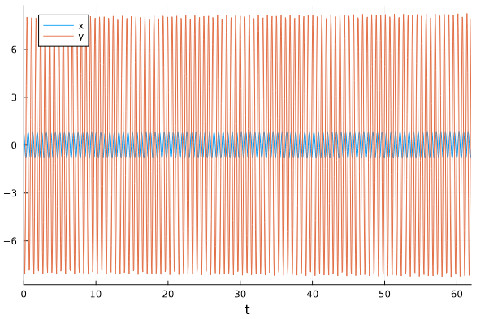{#fig:001 width=70%}

## Модель гармонического осциллятора без затухания и без действия внешней силы

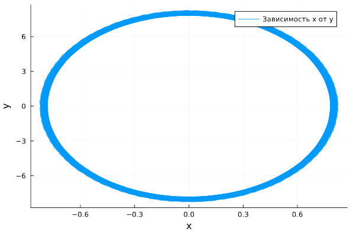{#fig:002 width=70%}

## Модель гармонического осциллятора без затухания и без действия внешней силы

```
model lab4_1
  parameter Real g = 0;
  parameter Real w = 10;
  parameter Real x0 = 0.8;
  parameter Real y0 = -1;
  Real x(start=x0);
  Real y(start=y0);
equation
    der(x) = y;
    der(y) = -g .*y - w^2 .*x;
end lab4_1;
```

## Модель гармонического осциллятора без затухания и без действия внешней силы

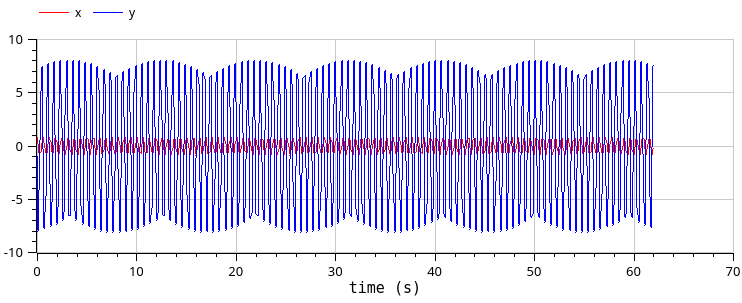{#fig:003 width=70%}

## Модель гармонического осциллятора без затухания и без действия внешней силы

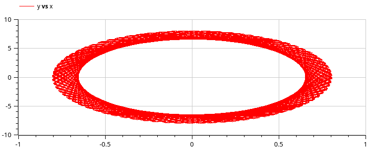{#fig:004 width=70%}

## Модель гармонического осциллятора с затуханием и без действия внешней силы

```Julia
using DifferentialEquations, Plots;

# Начальные условия
tspan = (0,62)
u0 = [0.8, -1]
p2 = [1.5, 3]
```

## Модель гармонического осциллятора с затуханием и без действия внешней силы

```Julia
# Задание функции
function f1(u, p, t)
    x, y = u
    g, w = p
    dx = y
    dy = -g .*y - w^2 .*x
    return [dx, dy]
end
```

## Модель гармонического осциллятора с затуханием и без действия внешней силы

```Julia
# Постановка проблемы и ее решение
problem2 = ODEProblem(f1, u0, tspan, p2)
sol2 = solve(problem2, Tsit5(), saveat = 0.05)
```

## Модель гармонического осциллятора с затуханием и без действия внешней силы

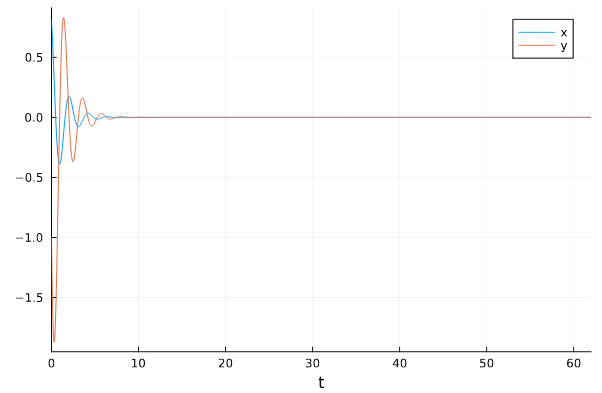{#fig:005 width=70%}

## Модель гармонического осциллятора с затуханием и без действия внешней силы

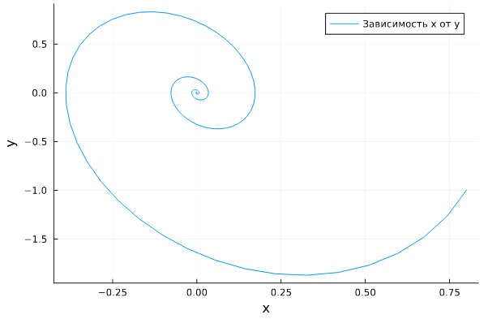{#fig:006 width=70%}

## Модель гармонического осциллятора с затуханием и без действия внешней силы

```
model lab4_2
  parameter Real g = 1.5;
  parameter Real w = 3;
  parameter Real x0 = 0.8;
  parameter Real y0 = -1;
  Real x(start=x0);
  Real y(start=y0);
equation
  der(x) = y;
  der(y) = -g .*y - w^2 .*x;
end lab4_2;
```

## Модель гармонического осциллятора с затуханием и без действия внешней силы

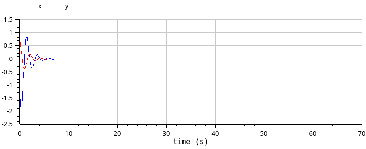{#fig:007 width=70%}

## Модель гармонического осциллятора с затуханием и без действия внешней силы

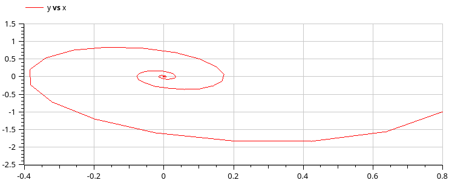{#fig:008 width=70%}

## Модель гармонического осциллятора с затуханием и действием внешней силы

```Julia
using DifferentialEquations, Plots;

# Начальные условия
tspan = (0,62)
u0 = [0.8, -1]
p3 = [0.6, 1]
f(t) = cos(1.5*t)
```

## Модель гармонического осциллятора с затуханием и действием внешней силы

```Julia
# Задание функции
function f2(u, p, t)
    x, y = u
    g, w = p
    dx = y
    dy = -g .*y - w^2 .*x .+f(t)
    return [dx, dy]
end
```

## Модель гармонического осциллятора с затуханием и действием внешней силы

```Julia
# Постановка проблемы и ее решение
problem3 = ODEProblem(f2, u0, tspan, p3)
sol3 = solve(problem1, Tsit5(), saveat = 0.05)
```

## Модель гармонического осциллятора с затуханием и действием внешней силы

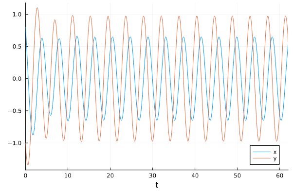{#fig:009 width=70%}


## Модель гармонического осциллятора с затуханием и действием внешней силы

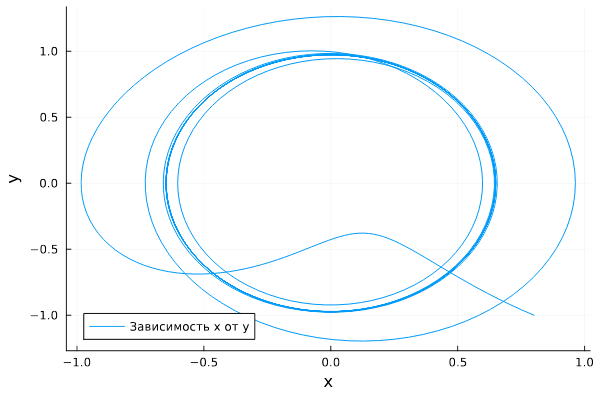{#fig:010 width=70%}


## Модель гармонического осциллятора с затуханием и действием внешней силы

```
model lab4_3
  parameter Real g = 0.6;
  parameter Real w = 1;
  parameter Real x0 = 0.8;
  parameter Real y0 = -1;
  Real x(start=x0);
  Real y(start=y0);
equation
  der(x) = y;
  der(y) = -g .*y - w^2 .*x + 1*cos(1.5*time);
end lab4_3;
```

## Модель гармонического осциллятора с затуханием и действием внешней силы

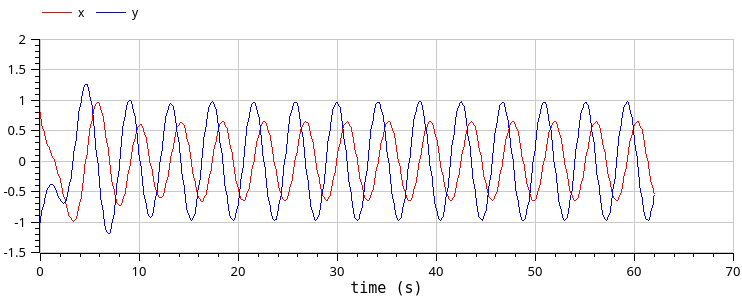{#fig:011 width=70%}

## Модель гармонического осциллятора с затуханием и действием внешней силы

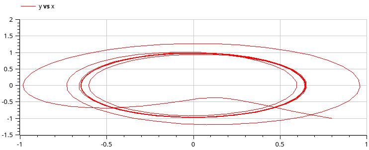{#fig:012 width=70%}

## Выводы

В процессе выполнения лабораторной работы построили математическую модель гармонического осциллятора.

