---
## Front matter
title: Лабораторная работа №4
subtitle: Модель гармонических колебаний
author: Клюкин Михаил Александрович

## Generic otions
lang: ru-RU
toc-title: "Содержание"

## Bibliography
bibliography: bib/cite.bib
csl: pandoc/csl/gost-r-7-0-5-2008-numeric.csl

## Pdf output format
toc: true # Table of contents
toc-depth: 2
lof: true # List of figures
lot: true # List of tables
fontsize: 12pt
linestretch: 1.5
papersize: a4
documentclass: scrreprt
## I18n polyglossia
polyglossia-lang:
  name: russian
  options:
	- spelling=modern
	- babelshorthands=true
polyglossia-otherlangs:
  name: english
## I18n babel
babel-lang: russian
babel-otherlangs: english
## Fonts
mainfont: IBM Plex Serif
romanfont: IBM Plex Serif
sansfont: IBM Plex Sans
monofont: IBM Plex Mono
mathfont: STIX Two Math
mainfontoptions: Ligatures=Common,Ligatures=TeX,Scale=0.94
romanfontoptions: Ligatures=Common,Ligatures=TeX,Scale=0.94
sansfontoptions: Ligatures=Common,Ligatures=TeX,Scale=MatchLowercase,Scale=0.94
monofontoptions: Scale=MatchLowercase,Scale=0.94,FakeStretch=0.9
mathfontoptions:
## Biblatex
biblatex: true
biblio-style: "gost-numeric"
biblatexoptions:
  - parentracker=true
  - backend=biber
  - hyperref=auto
  - language=auto
  - autolang=other*
  - citestyle=gost-numeric
## Pandoc-crossref LaTeX customization
figureTitle: "Рис."
tableTitle: "Таблица"
listingTitle: "Листинг"
lofTitle: "Список иллюстраций"
lotTitle: "Список таблиц"
lolTitle: "Листинги"
## Misc options
indent: true
header-includes:
  - \usepackage{indentfirst}
  - \usepackage{float} # keep figures where there are in the text
  - \floatplacement{figure}{H} # keep figures where there are in the text
---

# Цель работы

Построить математическую модель гармонического осциллятора

# Задание

Построить фазовый портрет гармонического осциллятора и решение уравнения
гармонического осциллятора для следующих случаев:

1. Колебания гармонического осциллятора без затуханий и без действий внешней
силы
 $$\ddot{x} + 10x = 0,$$

2. Колебания гармонического осциллятора c затуханием и без действий внешней силы 
  
  $$\ddot x + 1.5 \dot x + 3 x = 0,$$

3. Колебания гармонического осциллятора c затуханием и под действием внешней силы 
   
   $$\ddot x + 0.6 \dot x + 13 x = cos(1.5t).$$
На интервале $t \in [0; 62]$ (шаг 0.05) с начальными условиями $x_0 = 0.8, \,\, y_0 = -1$


# Выполнение лабораторной работы

## Модель гармонического осциллятора без затухания и без действия внешней силы

Реализуем модель на языке программирования Julia.

```Julia
using DifferentialEquations, Plots;

# Начальные условия
tspan = (0,62)
u0 = [0.8, -1]
p1 = [0, 10]

# Задание функции
function f1(u, p, t)
    x, y = u
    g, w = p
    dx = y
    dy = -g .*y - w^2 .*x
    return [dx, dy]
end

# Постановка проблемы и ее решение
problem1 = ODEProblem(f1, u0, tspan, p1)
sol1 = solve(problem1, Tsit5(), saveat = 0.05)
```

Получаем графики решения уравнения гармонического осцилятора (рис. [-@fig:001]) и его фазового портрета (рис. [-@fig:002]).

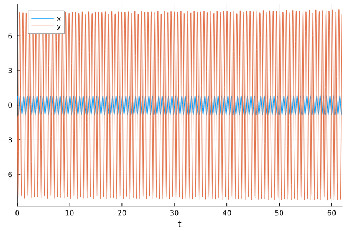{#fig:001 width=70%}

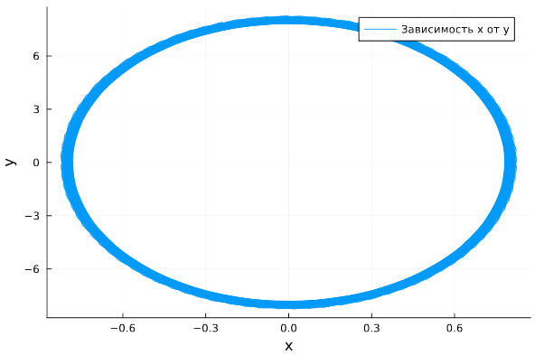{#fig:002 width=70%}

Заметим, что колебания осциллятора периодичны, график не затухает.

Реализуем эту модель посредством Open Modelica.

```
model lab4_1
  parameter Real g = 0;
  parameter Real w = 10;
  parameter Real x0 = 0.8;
  parameter Real y0 = -1;
  Real x(start=x0);
  Real y(start=y0);
equation
    der(x) = y;
    der(y) = -g .*y - w^2 .*x;
end lab4_1;
```

Получаем графики решения уравнения гармонического осцилятора (рис. [-@fig:003]) и его фазового портрета (рис. [-@fig:004]).

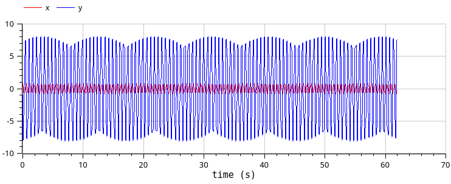{#fig:003 width=70%}

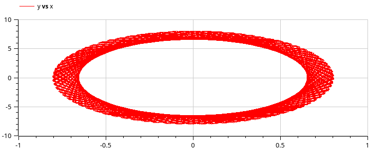{#fig:004 width=70%}

Видим, что графики, полученные с помощью Julia и OpenModelica идентичны.

## Модель гармонического осциллятора с затуханием и без действия внешней силы

Реализуем модель на языке программирования Julia.

```Julia
using DifferentialEquations, Plots;

# Начальные условия
tspan = (0,62)
u0 = [0.8, -1]
p2 = [1.5, 3]

# Задание функции
function f1(u, p, t)
    x, y = u
    g, w = p
    dx = y
    dy = -g .*y - w^2 .*x
    return [dx, dy]
end

# Постановка проблемы и ее решение
problem2 = ODEProblem(f1, u0, tspan, p2)
sol2 = solve(problem2, Tsit5(), saveat = 0.05)
```

Получаем графики решения уравнения гармонического осцилятора (рис. [-@fig:005]) и его фазового портрета (рис. [-@fig:006]).

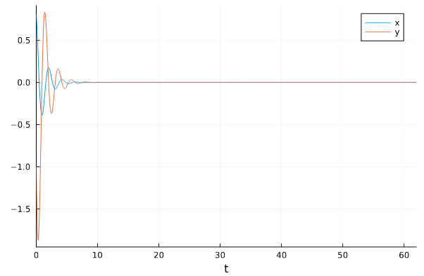{#fig:005 width=70%}

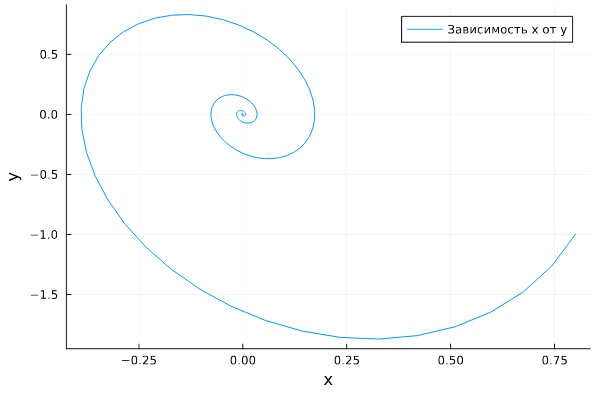{#fig:006 width=70%}

Видим, что сначала осциллятор колеблется, но затем его колебания затухают, поскольку у нас есть параметр, отвечающий за потери энергии.

Реализуем эту модель посредством OpenModelica.

```
model lab4_2
  parameter Real g = 1.5;
  parameter Real w = 3;
  parameter Real x0 = 0.8;
  parameter Real y0 = -1;
  Real x(start=x0);
  Real y(start=y0);
equation
  der(x) = y;
  der(y) = -g .*y - w^2 .*x;
end lab4_2;
```

Получаем графики решения уравнения гармонического осцилятора (рис. [-@fig:007]) и его фазового портрета (рис. [-@fig:008]).

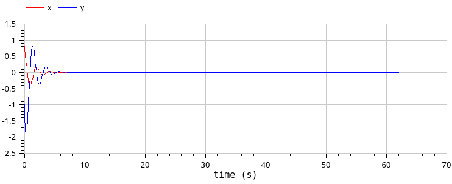{#fig:007 width=70%}

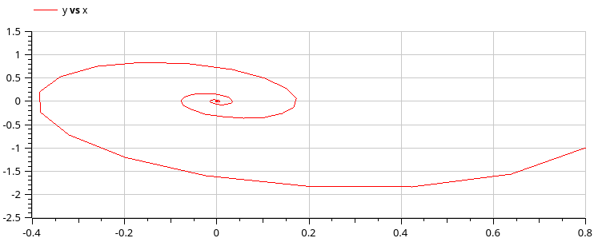{#fig:008 width=70%}

Видим, что графики, полученные с помощью Julia и OpenModelica идентичны.

## Модель гармонического осциллятора с затуханием и действием внешней силы

Реализуем модель на языке программирования Julia.

```Julia
using DifferentialEquations, Plots;

# Начальные условия
tspan = (0,62)
u0 = [0.8, -1]
p3 = [0.6, 1]
f(t) = cos(1.5*t)

# Задание функции
function f2(u, p, t)
    x, y = u
    g, w = p
    dx = y
    dy = -g .*y - w^2 .*x .+f(t)
    return [dx, dy]
end

# Постановка проблемы и ее решение
problem3 = ODEProblem(f2, u0, tspan, p3)
sol3 = solve(problem1, Tsit5(), saveat = 0.05)
```

Получаем графики решения уравнения гармонического осцилятора (рис. [-@fig:009]) и его фазового портрета (рис. [-@fig:010]).

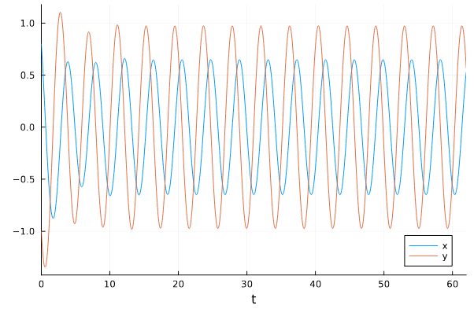{#fig:009 width=70%}

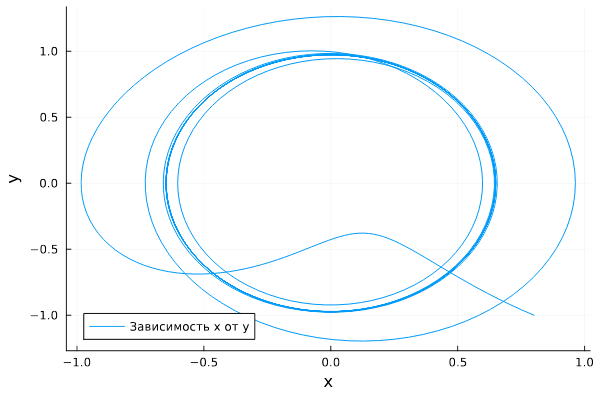{#fig:010 width=70%}

Реализуем эту модель посредством OpenModelica.

```
model lab4_3
  parameter Real g = 0.6;
  parameter Real w = 1;
  parameter Real x0 = 0.8;
  parameter Real y0 = -1;
  Real x(start=x0);
  Real y(start=y0);
equation
  der(x) = y;
  der(y) = -g .*y - w^2 .*x + 1*cos(1.5*time);
end lab4_3;
```

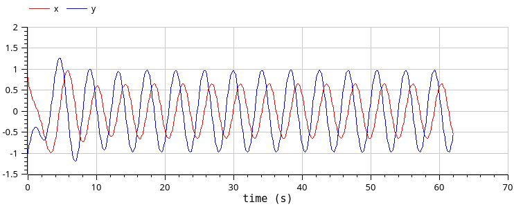{#fig:011 width=70%}

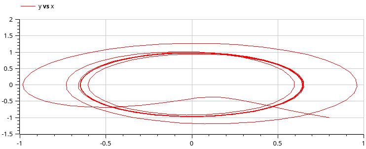{#fig:012 width=70%}

Видим, что графики, полученные с помощью Julia и OpenModelica идентичны.


# Выводы

В процессе выполнения лабораторной работы построили математическую модель гармонического осциллятора.

# Список литературы{.unnumbered}

::: {#refs}
:::
