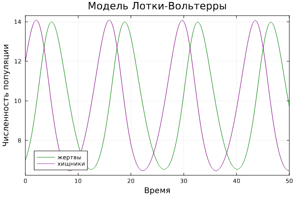
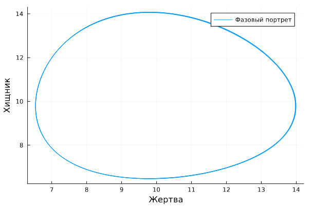
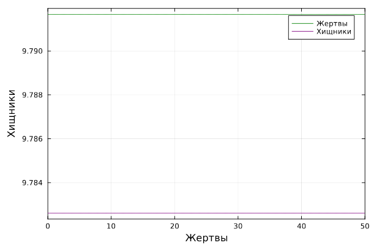
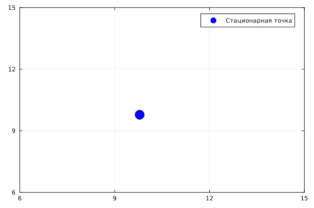
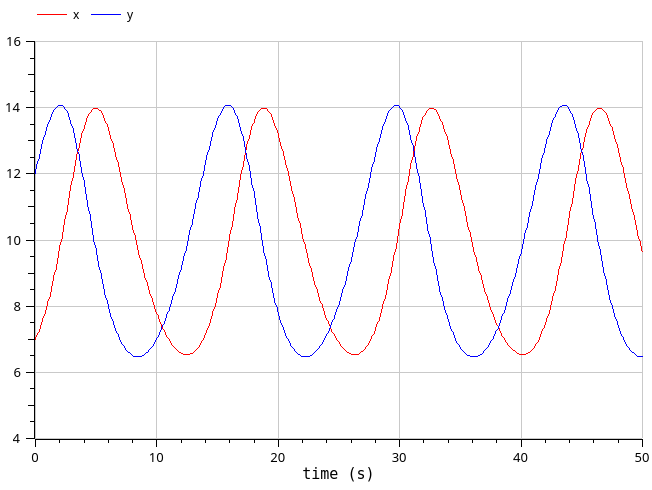
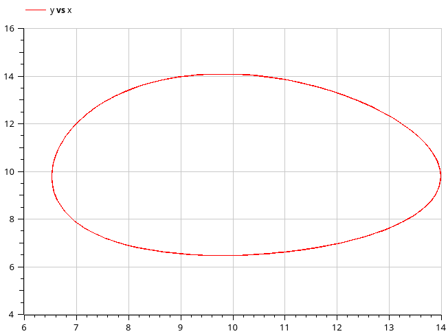
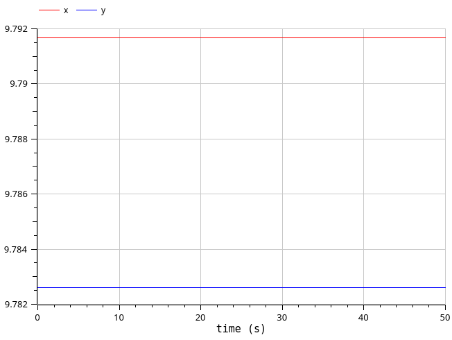

---
## Front matter
lang: ru-RU
title: Лабораторная работа №5
subtitle: Модель Лотки-Вольтерры
author:
  - Клюкин М. А.
institute:
  - Российский университет дружбы народов, Москва, Россия
  

## i18n babel
babel-lang: russian
babel-otherlangs: english

## Formatting pdf
toc: false
toc-title: Содержание
slide_level: 2
aspectratio: 169
section-titles: true
theme: metropolis
header-includes:
 - \metroset{progressbar=frametitle,sectionpage=progressbar,numbering=fraction}
 - \usepackage{fontspec}
 - \usepackage{polyglossia}
 - \setmainlanguage{russian}
 - \setotherlanguage{english}
 - \newfontfamily\cyrillicfont{Arial}
 - \newfontfamily\cyrillicfontsf{Arial}
 - \newfontfamily\cyrillicfonttt{Arial}
 - \setmainfont{Arial}
 - \setsansfont{Arial}
 
---


## Докладчик

:::::::::::::: {.columns align=center}
::: {.column width="70%"}

  * Клюкин Михаил Александрович
  * студент
  * Российский университет дружбы народов
  * [1132226431@pruf.ru](mailto:1132226431@pfur.ru)
  * <https://MaKYaro.github.io/ru/>

:::
::: {.column width="30%"}


:::
::::::::::::::

## Цель работы

Исследовать математическую модель Лотки-Вольтерры.

## Задание

$$
\begin{cases}
  \dfrac{dx}{dt} = -0.45 x(t) + 0.046 x(t) y(t)\\
  \dfrac{dy}{dt} = 0.47 y(t) - 0.048 x(t) y(t)
\end{cases}
$$

## Задание

1. Построить график зависимости численности хищников от численности жертв.   
2. Построить график изменения численности хищников и численности жертв при начальных условиях: $x_0 = 8, y_0 = 17$.    
3. Найдите стационарное состояние системы.   

## Теоретическое введение

$$
\begin{cases}
  \dfrac{dx}{dt} = a x(t) - b x(t) y(t)\\
  \dfrac{dy}{dt} = -c y(t) + d x(t) y(t)
\end{cases}
$$

## Выполнение лабораторной работы

Решим состему ДУ, используя язык программирования Julia и ПО OpenModelica.

## Реализация на Julia

```Julia
using DifferentialEquations, Plots;
function DE(u, p, t)
    x, y = u
    a, b, c, d = p
    dx = a*x - b*x*y
    dy = -c*y + d*x*y
    return [dx, dy]
end
```

## Реализация на Julia

```Julia
u0 = [7,12]
p = [-0.45, -0.046, -0.47, -0.048]
tspan = (0.0, 50.0)
```

## Реализация на Julia

```Julia
problem1 = ODEProblem(DE, u0, tspan, p)
solution1 = solve(problem1, Tsit5())
```

## Реализация на Julia

```Julia
plot(solution1, title = "Модель Лотки-Вольтерры", xaxis = "Время",     
yaxis = "Численность популяции", label = ["жертвы" "хищники"],      
c = ["green" "purple"], box =:on)
```

## Реализация на Julia

{#fig:001 width=70%}

## Реализация на Julia

{#fig:002 width=70%}

## Реализация на Julia

$$
\begin{cases}
  x_0 = \dfrac{c}{d}\\
  y_0 = \dfrac{a}{b}
\end{cases}
$$

## Реализация на Julia

$$
x_0 = 9.791, y_0 = 9.782
$$

## Реализация на Julia

```Julia
x_c = p[3]/p[4]
y_c = p[1]/p[2]
```

## Реализация на Julia

```Julia
u0_c = [x_c, y_c]
problem2 = ODEProblem(DE, u0_c, tspan, p)
solution2 = solve(problem2, Tsit5())
```

## Реализация на Julia

```Julia
plot(solution2, xaxis = "Жертвы", yaxis = "Хищники", label = ["Жертвы" "Хищники"],          
c = ["green" "purple"], box =:on)
```

## Реализация на Julia

{#fig:003 width=70%}

## Реализация на Julia

{#fig:004 width=70%}

## Реализация на OpenModelica

```
model mm_lab5_1
  parameter Real a = -0.45;
  parameter Real b = -0.046;
  parameter Real c = -0.47;
  parameter Real d = -0.048;
  parameter Real x0 = 7;
  parameter Real y0 = 12;
```

## Реализация на OpenModelica

```
  Real x(start=x0);
  Real y(start=y0);
equation
  der(x) = a*x - b*x*y;
  der(y) = -c*y + d*x*y;
end mm_lab5_1;
```

## Реализация на OpenModelica

{#fig:005 width=50%}

## Реализация на OpenModelica

{#fig:006 width=50%}

## Реализация на OpenModelica

```
model mm_lab5_2
  parameter Real a = -0.45;
  parameter Real b = -0.046;
  parameter Real c = -0.47;
  parameter Real d = -0.048;
  parameter Real x0 = c/d;
  parameter Real y0 = a/b;
```

## Реализация на OpenModelica

```
  Real x(start=x0);
  Real y(start=y0);
equation
  der(x) = a*x - b*x*y;
  der(y) = -c*y + d*x*y;
end mm_lab5_2;
```

## Реализация на OpenModelica

{#fig:007 width=50%}

## Выводы

Исследовали математическую модель Лотки-Вольтерры.
