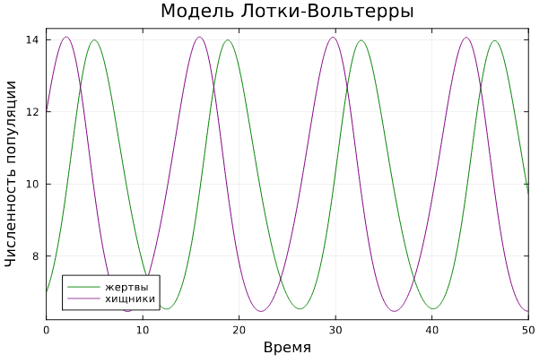
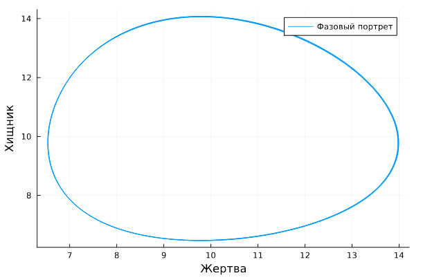
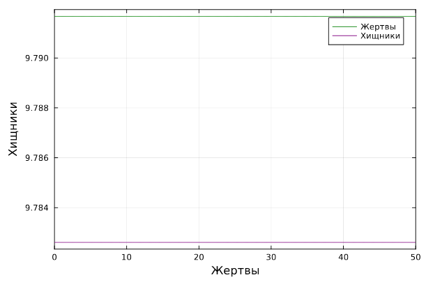
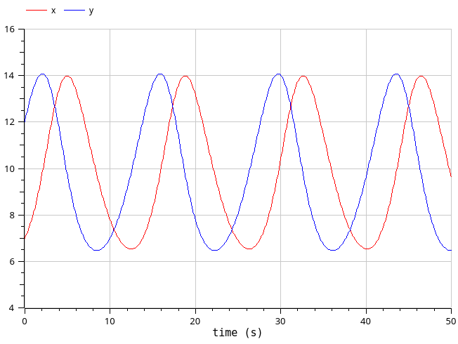
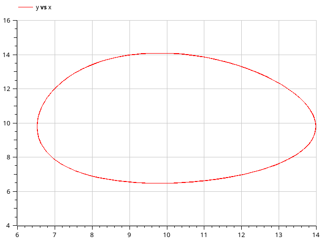
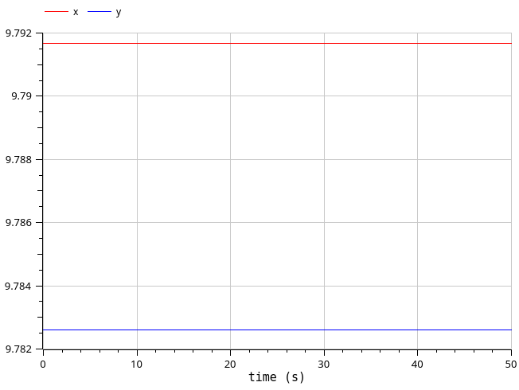

---
## Front matter
title: "Лабораторная работа №5"
subtitle: "Модель Лотки-Вольтерры"
author: "Клюкин Михаил Александрович"

## Generic otions
lang: ru-RU
toc-title: "Содержание"

## Bibliography
bibliography: bib/cite.bib
csl: pandoc/csl/gost-r-7-0-5-2008-numeric.csl

## Pdf output format
toc: true # Table of contents
toc-depth: 2
lof: true # List of figures
lot: true # List of tables
fontsize: 12pt
linestretch: 1.5
papersize: a4
documentclass: scrreprt
## I18n polyglossia
polyglossia-lang:
  name: russian
  options:
	- spelling=modern
	- babelshorthands=true
polyglossia-otherlangs:
  name: english
## I18n babel
babel-lang: russian
babel-otherlangs: english
## Fonts
mainfont: IBM Plex Serif
romanfont: IBM Plex Serif
sansfont: IBM Plex Sans
monofont: IBM Plex Mono
mathfont: STIX Two Math
mainfontoptions: Ligatures=Common,Ligatures=TeX,Scale=0.94
romanfontoptions: Ligatures=Common,Ligatures=TeX,Scale=0.94
sansfontoptions: Ligatures=Common,Ligatures=TeX,Scale=MatchLowercase,Scale=0.94
monofontoptions: Scale=MatchLowercase,Scale=0.94,FakeStretch=0.9
mathfontoptions:
## Biblatex
biblatex: true
biblio-style: "gost-numeric"
biblatexoptions:
  - parentracker=true
  - backend=biber
  - hyperref=auto
  - language=auto
  - autolang=other*
  - citestyle=gost-numeric
## Pandoc-crossref LaTeX customization
figureTitle: "Рис."
tableTitle: "Таблица"
listingTitle: "Листинг"
lofTitle: "Список иллюстраций"
lotTitle: "Список таблиц"
lolTitle: "Листинги"
## Misc options
indent: true
header-includes:
  - \usepackage{indentfirst}
  - \usepackage{float} # keep figures where there are in the text
  - \floatplacement{figure}{H} # keep figures where there are in the text
---

# Цель работы

Исследовать математическую модель Лотки-Вольтерры.

# Задание

Для модели "хищник-жертва":

$$
\begin{cases}
  \dfrac{dx}{dt} = -0.45 x(t) + 0.046 x(t) y(t)\\     
  \dfrac{dy}{dt} = 0.47 y(t) - 0.048 x(t) y(t)
\end{cases}
$$

Построить график зависимости численности хищников от численности жертв, а также график изменения численности хищников и численности жертв при следующих начальных условиях: $x_0 = 8, y_0 = 17$. 
Найдите стационарное состояние системы.

# Теоретическое введение

Простейшая модель взаимодействия двух видов типа «хищник — жертва» - модель Лотки-Вольтерры. Данная двувидовая модель основывается на следующих предположениях:

1. Численность популяции жертв x и хищников y зависят только от времени (модель не учитывает пространственное распределение популяции на занимаемой территории).
2. В отсутствии взаимодействия численность видов изменяется по модели Мальтуса, при этом число жертв увеличивается, а число хищников падает.
3. Естественная смертность жертвы и естественная рождаемость хищника считаются несущественными.
4. Эффект насыщения численности обеих популяций не учитывается.
5. Скорость роста численности жертв уменьшается пропорционально
численности хищников.

$$
\begin{cases}
  \dfrac{dx}{dt} = a x(t) - b x(t) y(t)\\
  \dfrac{dy}{dt} = -c y(t) + d x(t) y(t)
\end{cases}
$$

В этой модели $x$ – число жертв, $y$ - число хищников. Коэффициент $a$ описывает скорость естественного прироста числа жертв в отсутствие хищников, $с$ - естественное вымирание хищников, лишенных пищи в виде жертв. Вероятность взаимодействия жертвы и хищника считается пропорциональной как количеству жертв, так и числу самих хищников $(xy)$. Каждый акт взаимодействия уменьшает популяцию жертв, но способствует увеличению популяции хищников (члены $-bxy$ и $dxy$ в правой части уравнения).    

Математический анализ этой (жесткой) модели показывает, что имеется стационарное состояние, всякое же другое начальное состояние (B) приводит к периодическому колебанию численности как жертв, так и хищников, так что по прошествии некоторого времени система возвращается в состояние B.


# Выполнение лабораторной работы

Для того, чтобы построить графики нам нужно решить систему ДУ. Для этого используем язык программирования Julia и ПО OpenModelica. Затем сравним результаты.

## Реализация на Julia

Решим систему ДУ, используя библиотеку `DifferentialEquations`.   
Построим графики с помощью библиотеки `Plots`.

```Julia
# Подключаем библиотеки
using DifferentialEquations, Plots;

# задания системы ДУ, описывающей модель Лотки-Вольтерры
function DE(u, p, t)
    x, y = u
    a, b, c, d = p
    dx = a*x - b*x*y
    dy = -c*y + d*x*y
    return [dx, dy]
end

# Начальные условия
u0 = [7,12]
p = [-0.45, -0.046, -0.47, -0.048]
tspan = (0.0, 50.0)
problem1 = ODEProblem(DE, u0, tspan, p)
solution1 = solve(problem1, Tsit5())

# Постановка проблемы и ее решение
plot(solution1, title = "Модель Лотки-Вольтерры", xaxis = "Время",     
yaxis = "Численность популяции", label = ["жертвы" "хищники"],     
c = ["green" "purple"], box =:on)
```

В результате получаем графики изменения численностей хищников и жертв (рис. [-@fig:001]).   
И зависимость численности хищников от численности жертв (рис. [-@fig:002]).

{#fig:001 width=70%}

{#fig:002 width=70%}

Графики периодичны, фазовый портрет замкнут. Так и должно быть в жесткой модели Лотки-Вольтерры.

Далее найдем стационарные состояния системы по формулам:

$$
\begin{cases}
  x_0 = \dfrac{c}{d}\\
  y_0 = \dfrac{a}{b}
\end{cases}
$$

Получим, что $x_0 = 9.791$, $y_0 = 9.782$.

Проверим, что эта точка действительно является стационарной, подставив ее в начальные условия.

```Julia
x_c = p[3]/p[4]
y_c = p[1]/p[2]

u0_c = [x_c, y_c]
problem2 = ODEProblem(DE, u0_c, tspan, p)
solution2 = solve(problem2, Tsit5())

plot(solution2, xaxis = "Жертвы", yaxis = "Хищники", label = ["Жертвы" "Хищники"],   
c = ["green" "purple"], box =:on)
```

Получим график из двух прямых, параллельных оси абсцисс. 
То есть численности жертв и хищников не меняются.   
Так и должно быть в стационарном состоянии (рис. [-@fig:003]).

{#fig:003 width=70%}

Фазовый портрет в стационарном состоянии выглядит следующим образом (рис. [-@fig:004]).

{#fig:004 width=70%}

## Реализация на OpenModelica

Зададим параметры и систему ДУ:

```
model mm_lab5_1
  parameter Real a = -0.45;
  parameter Real b = -0.046;
  parameter Real c = -0.47;
  parameter Real d = -0.048;
  parameter Real x0 = 7;
  parameter Real y0 = 12;

  Real x(start=x0);
  Real y(start=y0);
equation
  der(x) = a*x - b*x*y;
  der(y) = -c*y + d*x*y;
end mm_lab5_1;
```

Выполним симуляцию на интервале (0, 50).
Получим следующие графики (рис. [-@fig:005], [-@fig:006]).

{#fig:005 width=70%}

{#fig:006 width=70%}

Графики периодичны, фазовый портрет замкнут, как и должно быть в жесткой модели Лотки-Вольтерры.

Также построим тут график изменения численносей хищников и жертв в стационарном состоянии (рис. [-@fig:007]).

```
model mm_lab5_2
  parameter Real a = -0.45;
  parameter Real b = -0.046;
  parameter Real c = -0.47;
  parameter Real d = -0.048;
  parameter Real x0 = c/d;
  parameter Real y0 = a/b;

  Real x(start=x0);
  Real y(start=y0);
equation
  der(x) = a*x - b*x*y;
  der(y) = -c*y + d*x*y;
end mm_lab5_2;
```

{#fig:007 width=70%}

## Сравнение построения модели 

Получили идентичные графики. Никаких особых различий не видно.

# Выводы

Исследовали математическую модель Лотки-Вольтерры.

# Список литературы{.unnumbered}

::: {#refs}
:::
