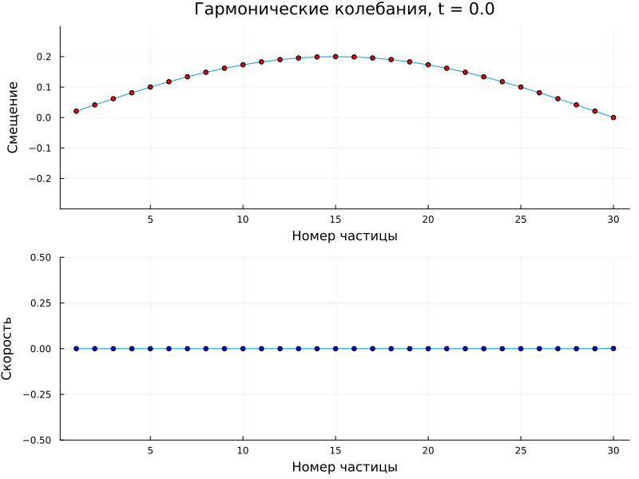
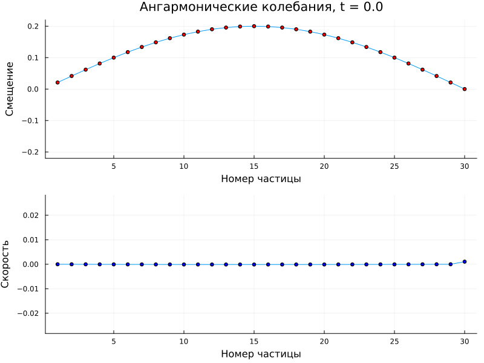

---
## Front matter
lang: ru-RU
title: Этап 3
subtitle: "Реализация программного комплекса"
author:
  - Канева Екатерина
  - Клюкин Михаил
  - Ланцова Яна
institute:
  - Российский университет дружбы народов, Москва, Россия
date: 11 апреля 2025

## i18n babel
babel-lang: russian
babel-otherlangs: english

## Formatting pdf
toc: false
toc-title: Содержание
slide_level: 2
aspectratio: 169
section-titles: true
theme: metropolis
header-includes:
 - \metroset{progressbar=frametitle,sectionpage=progressbar,numbering=fraction}
 - \usepackage{fontspec}
 - \usepackage{polyglossia}
 - \setmainlanguage{russian}
 - \setotherlanguage{english}
 - \newfontfamily\cyrillicfont{Arial}
 - \newfontfamily\cyrillicfontsf{Arial}
 - \newfontfamily\cyrillicfonttt{Arial}
 - \setmainfont{Arial}
 - \setsansfont{Arial}
 
---

# Информация

## Состав исследовательской команды

Студенты группы НФИбд-02-22:

- Канева Екатерина
- Клюкин Михаил
- Ланцова Яна

:::::::::::::: {.columns align=center}
::: {.column width="70%"}

:::
::::::::::::::

## Цель работы

Реализовать комплекс программ для решения поставленной задачи.

## Задание

1. Реализовать программу для моделирования гармонических колебаний.
2. Релализовать программу для моделирования ангармонических колебаний.


# Выполнение лабораторной работы

## Реализация алгоритма

```Julia
using Plots
using LinearAlgebra
using FFTW
using Dates
```

## Реализация алгоритма

```Julia
# Гармонические колебания
function harmonic_chain_simulation(;
    N=20,          # Количество частиц
    m=1.0,         # Масса частицы
    k=1.0,         # Жёсткость пружины
    α=0.0,         # Коэффициент ангармоничности (0 для гармонического случая)
    T=100.0,       # Общее время моделирования
    Δt=0.01,       # Шаг по времени
    Δd=1.0,        # Расстояние между частицами
    initial_displacement=0.1,  # Амплитуда начального возмущения
    save_every=10  # Сохранять состояние каждые save_every шагов
)
```

## Реализация алгоритма

```Julia
# Инициализация массивов (включая граничные условия)
y = zeros(N+2)  # Смещения (y[1] и y[N+2] - граничные условия)
v = zeros(N+2)  # Скорости
a = zeros(N+2)  # Ускорения
```

## Реализация алгоритма

```Julia    
# Начальные условия - синусоидальное возмущение
for i in 2:N+1
    y[i] = initial_displacement * sin(π*(i-1)/N)
end
```

## Реализация алгоритма

```Julia 
# Массивы для сохранения результатов
times = Float64[]
positions = Vector{Float64}[]
velocities = Vector{Float64}[]
```

 
## Основной цикл моделирования

```Julia
# Вычисление ускорений для внутренних частиц
for i in 2:N+1
    Δy_prev = y[i] - y[i-1]
    Δy_next = y[i+1] - y[i]
    
    # Гармоническая часть силы
    F_harmonic = k * (y[i+1] - 2*y[i] + y[i-1])
    
    # Ангармоническая часть силы (если α ≠ 0)
    F_anharmonic = α * (Δy_next^3 + Δy_prev^3)
    
    a[i] = (F_harmonic + F_anharmonic) / m
end
```

## Основной цикл моделирования

```Julia        
        # Обновление скоростей и смещений (метод Верле)
        for i in 2:N+1
            v[i] += a[i] * Δt
            y[i] += v[i] * Δt
        end
```

## Основной цикл моделирования

```Julia        
# Применение граничных условий
y[1] = 0.0
y[N+2] = 0.0
```

## Основной цикл моделирования

```Julia     
# Сохранение состояния (не на каждом шаге для экономии памяти)
if mod(round(t/Δt), save_every) == 0
    push!(times, t)
    push!(positions, copy(y[2:N+1]))  # Исключаем граничные точки
    push!(velocities, copy(v[2:N+1]))
end
```


## Функция для визуализации результатов

```Julia
function plot_chain_dynamics(times, positions, velocities; title="")
    # Генерируем уникальное имя файла на основе текущего времени
    timestamp = Dates.format(now(), "yyyy-mm-dd_HH-MM-SS")
    filename = "chain_dynamics_$(timestamp).gif"
```

## Анимация колебаний

```Julia 
anim = @animate for (i, t) in enumerate(times)
    p1 = plot(positions[i], 
              xlabel="Номер частицы", ylabel="Смещение",
              title="$title, t = $(round(t, digits=2))",
              ylims=(-maximum(abs.(positions[1]))*1.1, maximum(abs.(positions[1]))*1.1),
              legend=false)
    scatter!(p1, positions[i], color=:red)
```

## Анимация колебаний

```Julia        
p2 = plot(velocities[i],
          xlabel="Номер частицы", ylabel="Скорость",
          ylims=(-maximum(abs.(velocities[1]))*1.1, maximum(abs.(velocities[1]))*1.1),
          legend=false)
scatter!(p2, velocities[i], color=:blue)

plot(p1, p2, layout=(2,1))
```

## Анимация колебаний

```Julia
# Сохраняем анимацию в файл с уникальным именем
gif(anim, filename, fps=15)
println("Анимация сохранена в файл: ", filename)
```

## Функция для анализа спектра

```Julia
function analyze_spectrum(positions, Δt)
    # Анализ спектра для центральной частицы
    central_particle = [pos[length(pos)÷2] for pos in positions]
    n = length(central_particle)
    
    # Вычисление БПФ
    fft_result = fft(central_particle)
    freqs = fftfreq(n, 1/Δt)
    power = abs.(fft_result).^2
```

## Функция для анализа спектра

```Julia 
    # Только положительные частоты
    idx = freqs .> 0
    freqs = freqs[idx]
    power = power[idx]
    
    plot(freqs, power, xlabel="Частота", ylabel="Мощность", 
         title="Спектр колебаний центральной частицы", legend=false)
end
```

## Пример использования для гармонической цепочки

```Julia
times_harmonic, positions_harmonic, velocities_harmonic =    
harmonic_chain_simulation(
    N=30, T=50.0, Δt=0.05, initial_displacement=0.2, α=0.0
)
```

## Визуализация

```Julia
plot_chain_dynamics(
    times_harmonic, 
    positions_harmonic, 
    velocities_harmonic, 
    title="Гармонические колебания"
)
analyze_spectrum(positions_harmonic, 0.05)
```

## Пример использования для ангармонической цепочки

```Julia
times_anharmonic, positions_anharmonic, velocities_anharmonic = 
harmonic_chain_simulation(
    N=30, T=50.0, Δt=0.05, initial_displacement=0.2, α=0.1
)
```

## Визуализация

```Julia
plot_chain_dynamics(
    times_anharmonic, 
    positions_anharmonic, 
    velocities_anharmonic, 
    title="Ангармонические колебания"
)
analyze_spectrum(positions_anharmonic, 0.05)

```

## Гармонические колебания


{#fig:001 width=70%}


## Ангармонические колебания

{#fig:002 width=70%}


## Выводы

Реализовать комплекс программ для решения поставленной задачи. 
