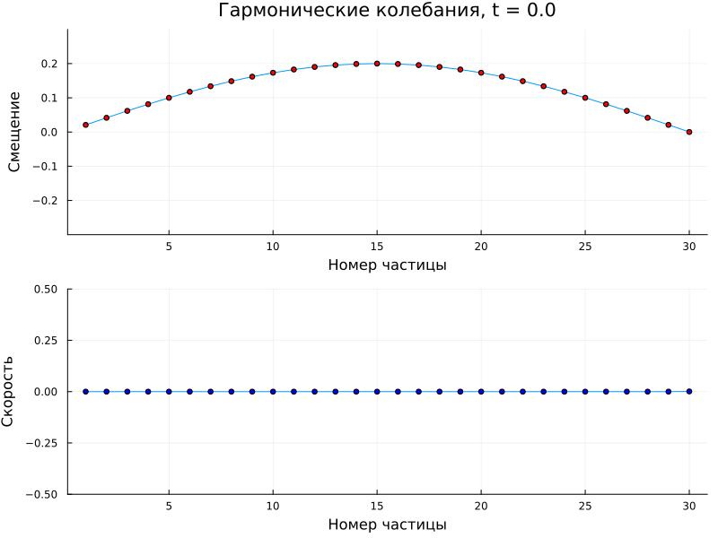
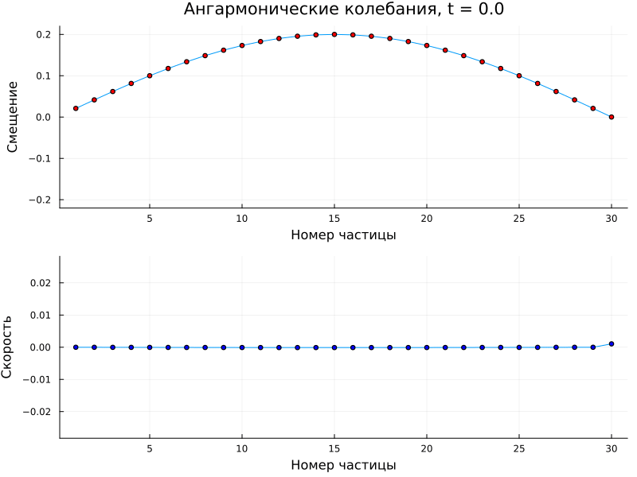

---
## Front matter
title: Этап 2
subtitle: "Программная реализация решения задачи"
author: 

  - Канева Екатерина
  - Клюкин Михаил
  - Ланцова Яна

## Generic otions
lang: ru-RU
toc-title: "Содержание"

## Bibliography
bibliography: bib/cite.bib
csl: pandoc/csl/gost-r-7-0-5-2008-numeric.csl

## Pdf output format
toc: true # Table of contents
toc-depth: 2
lof: true # List of figures
lot: true # List of tables
fontsize: 12pt
linestretch: 1.5
papersize: a4
documentclass: scrreprt
## I18n polyglossia
polyglossia-lang:
  name: russian
  options:
	- spelling=modern
	- babelshorthands=true
polyglossia-otherlangs:
  name: english
## I18n babel
babel-lang: russian
babel-otherlangs: english
## Fonts
mainfont: IBM Plex Serif
romanfont: IBM Plex Serif
sansfont: IBM Plex Sans
monofont: IBM Plex Mono
mathfont: STIX Two Math
mainfontoptions: Ligatures=Common,Ligatures=TeX,Scale=0.94
romanfontoptions: Ligatures=Common,Ligatures=TeX,Scale=0.94
sansfontoptions: Ligatures=Common,Ligatures=TeX,Scale=MatchLowercase,Scale=0.94
monofontoptions: Scale=MatchLowercase,Scale=0.94,FakeStretch=0.9
mathfontoptions:
## Biblatex
biblatex: true
biblio-style: "gost-numeric"
biblatexoptions:
  - parentracker=true
  - backend=biber
  - hyperref=auto
  - language=auto
  - autolang=other*
  - citestyle=gost-numeric
## Pandoc-crossref LaTeX customization
figureTitle: "Рис."
tableTitle: "Таблица"
listingTitle: "Листинг"
lofTitle: "Список иллюстраций"
lotTitle: "Список таблиц"
lolTitle: "Листинги"
## Misc options
indent: true
header-includes:
  - \usepackage{indentfirst}
  - \usepackage{float} # keep figures where there are in the text
  - \floatplacement{figure}{H} # keep figures where there are in the text
---

# Цель работы

Реализовать комплекс программ для решения поставленной задачи.

# Задание

1. Реализовать программу для моделирования гармонических колебаний.
2. Релализовать программу для моделирования ангармонических колебаний.


# Выполнение лабораторной работы

## Реализация алгоритма

```Julia
using Plots
using LinearAlgebra
using FFTW
using Dates

# Гармонические колебания
function harmonic_chain_simulation(;
    N=20,          # Количество частиц
    m=1.0,         # Масса частицы
    k=1.0,         # Жёсткость пружины
    α=0.0,         # Коэффициент ангармоничности (0 для гармонического случая)
    T=100.0,       # Общее время моделирования
    Δt=0.01,       # Шаг по времени
    Δd=1.0,        # Расстояние между частицами
    initial_displacement=0.1,  # Амплитуда начального возмущения
    save_every=10  # Сохранять состояние каждые save_every шагов
)
    # Инициализация массивов (включая граничные условия)
    y = zeros(N+2)  # Смещения (y[1] и y[N+2] - граничные условия)
    v = zeros(N+2)  # Скорости
    a = zeros(N+2)  # Ускорения
    
    # Начальные условия - синусоидальное возмущение
    for i in 2:N+1
        y[i] = initial_displacement * sin(π*(i-1)/N)
    end
    
    # Массивы для сохранения результатов
    times = Float64[]
    positions = Vector{Float64}[]
    velocities = Vector{Float64}[]
    
    # Основной цикл моделирования
    for t in 0:Δt:T
        # Вычисление ускорений для внутренних частиц
        for i in 2:N+1
            Δy_prev = y[i] - y[i-1]
            Δy_next = y[i+1] - y[i]
            
            # Гармоническая часть силы
            F_harmonic = k * (y[i+1] - 2*y[i] + y[i-1])
            
            # Ангармоническая часть силы (если α ≠ 0)
            F_anharmonic = α * (Δy_next^3 + Δy_prev^3)
            
            a[i] = (F_harmonic + F_anharmonic) / m
        end
        
        # Обновление скоростей и смещений (метод Верле)
        for i in 2:N+1
            v[i] += a[i] * Δt
            y[i] += v[i] * Δt
        end
        
        # Применение граничных условий
        y[1] = 0.0
        y[N+2] = 0.0
        
        # Сохранение состояния (не на каждом шаге для экономии памяти)
        if mod(round(t/Δt), save_every) == 0
            push!(times, t)
            push!(positions, copy(y[2:N+1]))  # Исключаем граничные точки
            push!(velocities, copy(v[2:N+1]))
        end
    end
    
    return times, positions, velocities
end

# Функция для визуализации результатов
function plot_chain_dynamics(times, positions, velocities; title="")
    # Генерируем уникальное имя файла на основе текущего времени
    timestamp = Dates.format(now(), "yyyy-mm-dd_HH-MM-SS")
    filename = "chain_dynamics_$(timestamp).gif"
    
    # Анимация колебаний
    anim = @animate for (i, t) in enumerate(times)
        p1 = plot(positions[i], 
                 xlabel="Номер частицы", ylabel="Смещение",
                 title="$title, t = $(round(t, digits=2))",
                 ylims=(-maximum(abs.(positions[1]))*1.1, maximum(abs.(positions[1]))*1.1),
                 legend=false)
        scatter!(p1, positions[i], color=:red)
        
        p2 = plot(velocities[i],
                 xlabel="Номер частицы", ylabel="Скорость",
                 ylims=(-maximum(abs.(velocities[1]))*1.1, maximum(abs.(velocities[1]))*1.1),
                 legend=false)
        scatter!(p2, velocities[i], color=:blue)
        
        plot(p1, p2, layout=(2,1))
    end
    
    # Сохраняем анимацию в файл с уникальным именем
    gif(anim, filename, fps=15)
    println("Анимация сохранена в файл: ", filename)
end

# Функция для анализа спектра
function analyze_spectrum(positions, Δt)
    # Анализ спектра для центральной частицы
    central_particle = [pos[length(pos)÷2] for pos in positions]
    n = length(central_particle)
    
    # Вычисление БПФ
    fft_result = fft(central_particle)
    freqs = fftfreq(n, 1/Δt)
    power = abs.(fft_result).^2
    
    # Только положительные частоты
    idx = freqs .> 0
    freqs = freqs[idx]
    power = power[idx]
    
    plot(freqs, power, xlabel="Частота", ylabel="Мощность", 
         title="Спектр колебаний центральной частицы", legend=false)
end

# Пример использования для гармонической цепочки
times_harmonic, positions_harmonic, velocities_harmonic = harmonic_chain_simulation(
    N=30, T=50.0, Δt=0.05, initial_displacement=0.2, α=0.0
)

# Визуализация
plot_chain_dynamics(times_harmonic, positions_harmonic, velocities_harmonic, title="Гармонические колебания")
analyze_spectrum(positions_harmonic, 0.05)

# Пример использования для ангармонической цепочки
times_anharmonic, positions_anharmonic, velocities_anharmonic = harmonic_chain_simulation(
    N=30, T=50.0, Δt=0.05, initial_displacement=0.2, α=0.1
)

# Визуализация
plot_chain_dynamics(times_anharmonic, positions_anharmonic, velocities_anharmonic, title="Ангармонические колебания")
analyze_spectrum(positions_anharmonic, 0.05)

```

## Полученные результаты

Выполнив моделирование, получим колебания гармонического осциллятора (рис. [-@fig:001]).

{#fig:001 width=70%}

Также смоделируем колебания ангармонического осциллятора при коэффициенте ангармоничности $\alpha = 50$ (рис. [-@fig:002]).

{#fig:002 width=70%}


# Выводы

Реализовать комплекс программ для решения поставленной задачи. 

# Список литературы{.unnumbered}

::: {#refs}
:::
