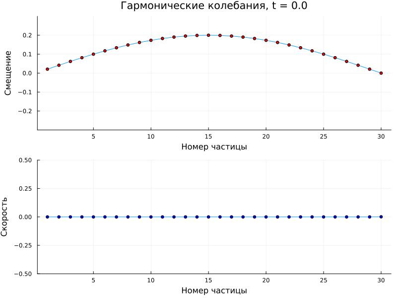
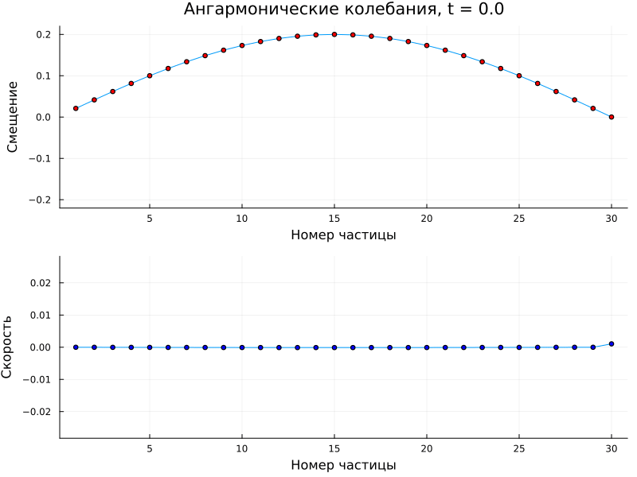

---
## Front matter
lang: ru-RU
title: Этап 4
subtitle: "Результаты проекта"
author:
  - Канева Екатерина
  - Клюкин Михаил
  - Ланцова Яна
institute:
  - Российский университет дружбы народов, Москва, Россия
date: 11 апреля 2025

## i18n babel
babel-lang: russian
babel-otherlangs: english

## Formatting pdf
toc: false
toc-title: Содержание
slide_level: 2
aspectratio: 169
section-titles: true
theme: metropolis
header-includes:
 - \metroset{progressbar=frametitle,sectionpage=progressbar,numbering=fraction}
 - \usepackage{fontspec}
 - \usepackage{polyglossia}
 - \setmainlanguage{russian}
 - \setotherlanguage{english}
 - \newfontfamily\cyrillicfont{Arial}
 - \newfontfamily\cyrillicfontsf{Arial}
 - \newfontfamily\cyrillicfonttt{Arial}
 - \setmainfont{Arial}
 - \setsansfont{Arial}
 
---

# Информация

## Состав исследовательской команды

Студенты группы НФИбд-02-22:

- Канева Екатерина
- Клюкин Михаил
- Ланцова Яна

:::::::::::::: {.columns align=center}
::: {.column width="70%"}

:::
::::::::::::::


# Введение

## Актуальность

Все вещества состоят из атомов, которые постоянно колеблются. Изучение этих колебаний помогает нам понять, как материалы ведут себя при разных температурах. Особенно важно понимать, как колебания приводят к тепловому равновесию. Исследование цепочек атомов, связанных пружинками, это простая модель, чтобы понять, как возникают колебания в кристаллах. Эта модель помогает объяснить, почему некоторые классические законы физики работают только при высоких температурах. Понимание колебаний важно для создания новых материалов с нужными свойствами, например, для электроники или термоизоляции.

## Цель работы

Исследовать закономерности колебаний в простейшей одномерной цепочке атомов, связанных между собой.

## Объект и предмет исследования

1. Изучение условий для установления равновесия 
2. Изучение условий для приближения к равновесию
3. Изучение явлений в простейшем одномерном случае

## Задачи

1. Построить модель цепочки из N частиц.
2. Описать алгоритм для моделирования гармонических и ангармонических колебаний.
3. Реализовать программу для моделирования гармонических и ангармонических колебаний.

## Материалы и методы

Язык программирования Julia

- Plots.jl
- LinearAlgebra
- FFTW

# Теоретическое описание задачи 

## Гармоническая цепочка

$$
F_i = k(y_{i+1} - y_i) - k(y_i - y_{i-1}) = k(y_{i+1} - 2y_i + y_{i-1}).
$$

## Гармоническая цепочка

$$
m \dfrac{d^2 y_i}{dt^2} = k(y_{i+1} - 2y_i + y_{i-1}), \quad i = 1, \dots, N.
$$

## Полная энергия системы

$$
U = \dfrac{m}{2} \sum_{i=1}^{N} \left( \frac{d y_i}{dt} \right)^2 + \dfrac{k}{2} \sum_{i=1}^{N+1} (y_i - y_{i-1})^2.
$$

## Решение уравнения

$$
y_i = \left( A \cos (p x_i) + B \sin (p x_i) \right) \cos (\omega t).
$$

## Решение уравнения

$$
\sin (p (N+1)d) = 0.
$$

## Решение уравнения

$$
p_l = \dfrac{l \pi}{(N+1)d}, \quad l = 1, \dots, N.
$$

## Ангармоническая цепочка

$$
 F = -kx \left(1 - \dfrac{\alpha x}{d} \right).
$$

## Ангармоническая цепочка

$$
 U = \dfrac{m}{2} \sum_{i=1}^{N} \left( \frac{d y_i}{dt} \right)^2 + \dfrac{k}{2} \sum_{i=1}^{N+1} \left(y_i - y_{i-1}\right)^2 - \dfrac{k \alpha}{3d} \sum_{i=1}^{N+1} \left(y_i - y_{i-1}\right)^3.
$$

## Программная реализация

```Julia
# Гармонические колебания
function harmonic_chain_simulation(;
    N=20,          # Количество частиц
    m=1.0,         # Масса частицы
    k=1.0,         # Жёсткость пружины
    alpha=0.0,         # Коэффициент ангармоничности (0 для гармонического случая)
    T=100.0,       # Общее время моделирования
    dt=0.01,       # Шаг по времени
    dd=1.0,        # Расстояние между частицами
    initial_displacement=0.1,  # Амплитуда начального возмущения
    save_every=10  # Сохранять состояние каждые save_every шагов
)
```

## Программная реализация

```Julia
# Инициализация массивов (включая граничные условия)
y = zeros(N+2)  # Смещения (y[1] и y[N+2] - граничные условия)
v = zeros(N+2)  # Скорости
a = zeros(N+2)  # Ускорения
```

## Программная реализация

```Julia    
# Начальные условия - синусоидальное возмущение
for i in 2:N+1
    y[i] = initial_displacement * sin(pi*(i-1)/N)
end
```

## Программная реализация

```Julia 
# Массивы для сохранения результатов
times = Float64[]
positions = Vector{Float64}[]
velocities = Vector{Float64}[]
```

 
## Программная реализация

```Julia
# Вычисление ускорений для внутренних частиц
for i in 2:N+1
    dy_prev = y[i] - y[i-1]
    dy_next = y[i+1] - y[i]
    
    # Гармоническая часть силы
    F_harmonic = k * (y[i+1] - 2*y[i] + y[i-1])
    
    # Ангармоническая часть силы (если α ≠ 0)
    F_anharmonic = alpha * (dy_next^3 + dy_prev^3)
    
    a[i] = (F_harmonic + F_anharmonic) / m
end
```

## Программная реализация

```Julia        
        # Обновление скоростей и смещений (метод Верле)
        for i in 2:N+1
            v[i] += a[i] * dt
            y[i] += v[i] * dt
        end
```

## Программная реализация

```Julia        
# Применение граничных условий
y[1] = 0.0
y[N+2] = 0.0
```

## Программная реализация

```Julia     
# Сохранение состояния (не на каждом шаге для экономии памяти)
if mod(round(t/dt), save_every) == 0
    push!(times, t)
    push!(positions, copy(y[2:N+1]))  # Исключаем граничные точки
    push!(velocities, copy(v[2:N+1]))
end
```

## Результаты


{#fig:001 width=70%}

## Результаты

{#fig:002 width=70%}

## Выводы

- Построили модель цепочки из N частиц.
- Описали алгоритм для моделирования гармонических и ангармонических колебаний.
- Реализовали программу для моделирования гармонических и ангармонических колебаний.


